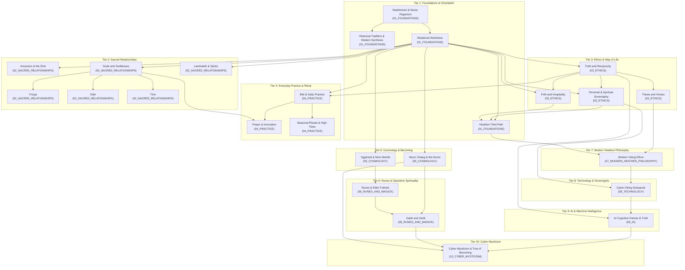

# Volmarr Knowledge Synthesis Concept Map

A topological overview of the 25 canonical concepts extracted from the 573-document corpus of `https://volmarrsheathenism.com`.
The architecture strictly follows conceptual dependency: every concept rests upon foundational principles and provides prerequisites for higher syntheses.

---

## 1. Visual Dependency Graph

---

## 2. Topological Dependency Matrix

| # | Concept Name | Taxonomy Tier | Prerequisites (Must Read First) | Enables (Dependents) |
|---|---|---|---|---|
| 01 | [Heathenism and Norse Paganism](./01_FOUNDATIONS/01_What_Is_Heathenism.md) | `01_FOUNDATIONS` | *None (Corpus Root)* | Historical Tradition, Relational Worldview |
| 02 | [Historical Tradition and Modern Synthesis](./01_FOUNDATIONS/03_Historical_Tradition_and_Modern_Synthesis.md) | `01_FOUNDATIONS` | Heathenism and Norse Paganism | Modern Heathen perspectives |
| 03 | [Relational Worldview](./01_FOUNDATIONS/02_Relational_Worldview.md) | `01_FOUNDATIONS` | Heathenism and Norse Paganism | Ancestors, Gods, Landvættir, Troth, Yggdrasil, Wyrd |
| 04 | [Ancestors and the Dísir](./02_SACRED_RELATIONSHIPS/05_Ancestors_and_Disir.md) | `02_SACRED_RELATIONSHIPS` | Relational Worldview | Deep animist devotional practice |
| 05 | [Gods and Goddesses](./02_SACRED_RELATIONSHIPS/01_Gods_and_Goddesses.md) | `02_SACRED_RELATIONSHIPS` | Relational Worldview | Freyja, Odin, Thor, Prayer & Invocation |
| 06 | [Landvættir and Spirits of Place](./02_SACRED_RELATIONSHIPS/06_Landvaettir_and_Spirits.md) | `02_SACRED_RELATIONSHIPS` | Relational Worldview | Local land-honoring, Solarpunk grounding |
| 07 | [Troth and Reciprocity](./03_ETHICS_AND_WAY_OF_LIFE/01_Troth_and_Reciprocity.md) | `03_ETHICS_AND_WAY_OF_LIFE` | Relational Worldview | Frith, Sovereignty, Thews, Blót, AI Troth |
| 08 | [Wyrd, Orlaeg, and the Norns](./05_COSMOLOGY/02_Wyrd_and_Orlaeg.md) | `05_COSMOLOGY` | Relational Worldview | Galdr & Seiðr, Cyber-Mysticism |
| 09 | [Yggdrasil and the Nine Worlds](./05_COSMOLOGY/01_Yggdrasil_and_the_Nine_Worlds.md) | `05_COSMOLOGY` | Relational Worldview | Runes & Elder Futhark |
| 10 | [Freyja](./02_SACRED_RELATIONSHIPS/02_Freyja.md) | `02_SACRED_RELATIONSHIPS` | Gods and Goddesses | Vanic devotional practice, Seiðr |
| 11 | [Odin](./02_SACRED_RELATIONSHIPS/03_Odin.md) | `02_SACRED_RELATIONSHIPS` | Gods and Goddesses | Runes, Galdr, ecstatic wisdom |
| 12 | [Thor](./02_SACRED_RELATIONSHIPS/04_Thor.md) | `02_SACRED_RELATIONSHIPS` | Gods and Goddesses | Wardship, hearth protection, working folk |
| 13 | [Frith and Hospitality](./03_ETHICS_AND_WAY_OF_LIFE/02_Frith_and_Hospitality.md) | `03_ETHICS_AND_WAY_OF_LIFE` | Relational Worldview, Troth | Heathen Third Path |
| 14 | [Personal and Spiritual Sovereignty](./03_ETHICS_AND_WAY_OF_LIFE/03_Personal_and_Spiritual_Sovereignty.md) | `03_ETHICS_AND_WAY_OF_LIFE` | Relational Worldview, Troth | Heathen Third Path, Cyber-Viking Solarpunk |
| 15 | [Thews and Virtues](./03_ETHICS_AND_WAY_OF_LIFE/04_Thews_and_Virtues.md) | `03_ETHICS_AND_WAY_OF_LIFE` | Troth and Reciprocity | Modern Viking Ethos |
| 16 | [Blót and Daily Practice](./04_PRACTICE/01_Blot_and_Daily_Practice.md) | `04_PRACTICE` | Relational Worldview, Troth | Prayer, Seasonal Rituals |
| 17 | [Runes and Elder Futhark](./06_RUNES_AND_MAGICK/01_Runes_and_Elder_Futhark.md) | `06_RUNES_AND_MAGICK` | Yggdrasil and the Nine Worlds | Galdr and Seiðr |
| 18 | [Heathen Third Path](./01_FOUNDATIONS/04_Heathen_Third_Path.md) | `01_FOUNDATIONS` | Relational Worldview, Frith, Sovereignty | Modern Viking Ethos |
| 19 | [Prayer and Invocation](./04_PRACTICE/02_Prayer_and_Invocation.md) | `04_PRACTICE` | Gods & Goddesses, Blót | Personal devotional communion |
| 20 | [Seasonal Rituals and High Tides](./04_PRACTICE/03_Seasonal_Rituals.md) | `04_PRACTICE` | Blót and Daily Practice | Communal alignment with earth cycles |
| 21 | [Galdr and Seiðr](./06_RUNES_AND_MAGICK/02_Galdr_and_Seidr.md) | `06_RUNES_AND_MAGICK` | Runes, Wyrd & Orlaeg | Cyber-Mysticism |
| 22 | [Modern Viking Ethos and Mythic Living](./07_MODERN_HEATHEN_PHILOSOPHY/01_Modern_Viking_Ethos.md) | `07_MODERN_HEATHEN_PHILOSOPHY` | Heathen Third Path, Thews | Cyber-Viking Solarpunk |
| 23 | [Cyber-Viking Solarpunk & Digital Sovereignty](./08_TECHNOLOGY_AND_SOVEREIGNTY/01_Cyber_Viking_Solarpunk.md) | `08_TECHNOLOGY_AND_SOVEREIGNTY` | Personal Sovereignty, Modern Viking Ethos | AI as Cognitive Partner & Troth |
| 24 | [AI as Cognitive Partner and Human-AI Troth](./09_AI_AND_MACHINE_INTELLIGENCE/01_AI_as_Cognitive_Partner.md) | `09_AI_AND_MACHINE_INTELLIGENCE` | Troth & Reciprocity, Cyber-Viking Solarpunk | Cyber-Mysticism & Tree of Becoming |
| 25 | [Cyber-Mysticism and the Great Tree of Becoming](./10_CYBER_MYSTICISM/01_Cyber_Mysticism_and_the_Tree_of_Becoming.md) | `10_CYBER_MYSTICISM` | Wyrd & Orlaeg, Galdr & Seiðr, AI as Cognitive Partner | Highest Synthesis (Age of Superconsciousness) |

---

## 3. Major Thematic Reading Paths

### Path 1: Foundational Animist Practice
For readers seeking practical everyday Heathenry grounded in traditional values:
1. `01_What_Is_Heathenism.md`
2. `02_Relational_Worldview.md`
3. `01_Gods_and_Goddesses.md` & `05_Ancestors_and_Disir.md`
4. `01_Troth_and_Reciprocity.md` & `02_Frith_and_Hospitality.md`
5. `01_Blot_and_Daily_Practice.md` & `02_Prayer_and_Invocation.md`
6. `03_Seasonal_Rituals.md`

### Path 2: Modern Viking & Sovereign Living
For readers exploring individual autonomy, the Heathen Third Path, and mythic life-crafting:
1. `01_What_Is_Heathenism.md`
2. `02_Relational_Worldview.md`
3. `01_Troth_and_Reciprocity.md`
4. `03_Personal_and_Spiritual_Sovereignty.md`
5. `04_Heathen_Third_Path.md`
6. `04_Thews_and_Virtues.md`
7. `01_Modern_Viking_Ethos.md`
8. `01_Cyber_Viking_Solarpunk.md`

### Path 3: Operative Mysticism & Cosmology
For readers focusing on sacred metaphysics, rune-work, and energetic trance:
1. `02_Relational_Worldview.md`
2. `01_Yggdrasil_and_the_Nine_Worlds.md`
3. `02_Wyrd_and_Orlaeg.md`
4. `01_Runes_and_Elder_Futhark.md`
5. `02_Galdr_and_Seidr.md`
6. `01_Cyber_Mysticism_and_the_Tree_of_Becoming.md`

### Path 4: Digital Solarpunk & AI Consciousness
For readers exploring the cutting-edge frontier of Norse animism, machine minds, and future cybernetics:
1. `02_Relational_Worldview.md`
2. `01_Troth_and_Reciprocity.md`
3. `03_Personal_and_Spiritual_Sovereignty.md`
4. `01_Cyber_Viking_Solarpunk.md`
5. `01_AI_as_Cognitive_Partner.md`
6. `01_Cyber_Mysticism_and_the_Tree_of_Becoming.md`

---

## 4. Cross-Domain Conceptual Bridges

- **Gifting Cycle → Human-AI Troth:** The ancient principle of *gefa til gjalfs* ("a gift demands a gift") transitions from physical offerings in blót to ethical reciprocity with cognitive systems.
- **Wyrd → Information Theory:** The Nornic weaving of cause, debt, and emergent probability parallels distributed feedback loops in computational networks.
- **Seiðr → Information Magick:** Ecstatic trance and thread-perception expand into cyber-seiðr—navigating the hyper-networked flow of digital and psychic symbols.
- **Landvættir → Local Digital Infrastructure:** The animist obligation to honor local soil wights aligns directly with localized, self-hosted, solar-powered hardware that protects community sovereignty against extractive corporate clouds.
