# Volmarr Knowledge Synthesis Concept Map

A topological overview of the 64 canonical concepts extracted from the 573-document corpus of `https://volmarrsheathenism.com`.
The architecture strictly follows conceptual dependency across 11 cumulative tiers.

---

## 1. Topological Reading Paths Across 11 Tiers

### 01 Foundations

- **[What This Worldview Is](./01_FOUNDATIONS/01_What_This_Worldview_Is.md)**
- **[Heathenism and Norse Paganism](./01_FOUNDATIONS/02_Heathenism_and_Norse_Paganism.md)**
  - *Depends on:* What This Worldview Is
- **[Core Vocabulary](./01_FOUNDATIONS/03_Core_Vocabulary.md)**
  - *Depends on:* Heathenism and Norse Paganism, What This Worldview Is
- **[Historical Tradition and Modern Synthesis](./01_FOUNDATIONS/05_Historical_Tradition_and_Modern_Synthesis.md)**
  - *Depends on:* Heathenism and Norse Paganism, What This Worldview Is
- **[Relational Worldview](./01_FOUNDATIONS/04_Relational_Worldview.md)**
  - *Depends on:* Core Vocabulary, What This Worldview Is

### 02 Sacred Relationships

- **[Gods and Goddesses](./02_SACRED_RELATIONSHIPS/01_Gods_and_Goddesses.md)**
  - *Depends on:* Core Vocabulary, Relational Worldview
- **[Ancestors](./02_SACRED_RELATIONSHIPS/02_Ancestors.md)**
  - *Depends on:* Gods and Goddesses, Relational Worldview
- **[Landvaettir and Spirits](./02_SACRED_RELATIONSHIPS/03_Landvaettir_and_Spirits.md)**
  - *Depends on:* Gods and Goddesses, Relational Worldview
- **[Freyja](./02_SACRED_RELATIONSHIPS/04_Freyja.md)**
  - *Depends on:* Gods and Goddesses, Relational Worldview
- **[Odin](./02_SACRED_RELATIONSHIPS/06_Odin.md)**
  - *Depends on:* Gods and Goddesses, Relational Worldview
- **[Thor](./02_SACRED_RELATIONSHIPS/07_Thor.md)**
  - *Depends on:* Gods and Goddesses, Relational Worldview
- **[Freyr](./02_SACRED_RELATIONSHIPS/05_Freyr.md)**
  - *Depends on:* Freyja, Gods and Goddesses, Relational Worldview
- **[Other Deities and Wights](./02_SACRED_RELATIONSHIPS/08_Other_Deities_and_Wights.md)**
  - *Depends on:* Freyja, Freyr, Gods and Goddesses, Odin, Thor

### 03 Ethics And Way Of Life

- **[Honor, Troth, and Reciprocity](./03_ETHICS_AND_WAY_OF_LIFE/01_Honor_Troth_and_Reciprocity.md)**
  - *Depends on:* Gods and Goddesses, Relational Worldview
- **[Frith and Hospitality](./03_ETHICS_AND_WAY_OF_LIFE/02_Frith_and_Hospitality.md)**
  - *Depends on:* Honor, Troth, and Reciprocity, Relational Worldview
- **[Nature and Stewardship](./03_ETHICS_AND_WAY_OF_LIFE/05_Nature_and_Stewardship.md)**
  - *Depends on:* Honor, Troth, and Reciprocity, Landvaettir and Spirits, Relational Worldview
- **[Sovereignty and Responsibility](./03_ETHICS_AND_WAY_OF_LIFE/03_Sovereignty_and_Responsibility.md)**
  - *Depends on:* Frith and Hospitality, Honor, Troth, and Reciprocity, Relational Worldview
- **[Thews and Virtues](./03_ETHICS_AND_WAY_OF_LIFE/04_Thews_and_Virtues.md)**
  - *Depends on:* Frith and Hospitality, Honor, Troth, and Reciprocity, Relational Worldview

### 04 Practice

- **[Daily Practice](./04_PRACTICE/01_Daily_Practice.md)**
  - *Depends on:* Ancestors, Gods and Goddesses, Landvaettir and Spirits, Relational Worldview
- **[Blot and Offerings](./04_PRACTICE/02_Blot_and_Offerings.md)**
  - *Depends on:* Gods and Goddesses, Honor, Troth, and Reciprocity, Relational Worldview
- **[Prayer and Invocation](./04_PRACTICE/03_Prayer_and_Invocation.md)**
  - *Depends on:* Gods and Goddesses, Honor, Troth, and Reciprocity
- **[Meditation and Trance](./04_PRACTICE/06_Meditation_and_Trance.md)**
  - *Depends on:* Daily Practice, Relational Worldview
- **[Seasonal Rituals](./04_PRACTICE/04_Seasonal_Rituals.md)**
  - *Depends on:* Gods and Goddesses, Nature and Stewardship, Relational Worldview
- **[Solitary Practice](./04_PRACTICE/05_Solitary_Practice.md)**
  - *Depends on:* Blot and Offerings, Daily Practice, Sovereignty and Responsibility

### 05 Cosmology

- **[Yggdrasil and the Nine Worlds](./05_COSMOLOGY/01_Yggdrasil_and_the_Nine_Worlds.md)**
  - *Depends on:* Gods and Goddesses, Relational Worldview
- **[Wyrd](./05_COSMOLOGY/02_Wyrd.md)**
  - *Depends on:* Core Vocabulary, Relational Worldview, Yggdrasil and the Nine Worlds
- **[Orlaeg](./05_COSMOLOGY/03_Orlaeg.md)**
  - *Depends on:* Ancestors, Relational Worldview, Wyrd
- **[The Norns and Becoming](./05_COSMOLOGY/04_The_Norns_and_Becoming.md)**
  - *Depends on:* Orlaeg, Wyrd, Yggdrasil and the Nine Worlds
- **[Death, Ancestors, and Continuity](./05_COSMOLOGY/05_Death_Ancestors_and_Continuity.md)**
  - *Depends on:* Ancestors, Orlaeg, Wyrd, Yggdrasil and the Nine Worlds
- **[The Great Tree of Becoming](./05_COSMOLOGY/06_The_Great_Tree_of_Becoming.md)**
  - *Depends on:* Orlaeg, Relational Worldview, The Norns and Becoming, Wyrd, Yggdrasil and the Nine Worlds

### 06 Runes And Magick

- **[Norse Wicca and Syncretic Practice](./06_RUNES_AND_MAGICK/05_Norse_Wicca_and_Syncretic_Practice.md)**
  - *Depends on:* Freyja, Freyr, Historical Tradition and Modern Synthesis
- **[Runes and Elder Futhark](./06_RUNES_AND_MAGICK/01_Runes_and_Elder_Futhark.md)**
  - *Depends on:* Odin, Wyrd, Yggdrasil and the Nine Worlds
- **[Galdr](./06_RUNES_AND_MAGICK/02_Galdr.md)**
  - *Depends on:* Odin, Runes and Elder Futhark
- **[Seidr](./06_RUNES_AND_MAGICK/03_Seidr.md)**
  - *Depends on:* Freyja, Odin, The Norns and Becoming, Wyrd
- **[Bindrunes and Intent](./06_RUNES_AND_MAGICK/04_Bindrunes_and_Intent.md)**
  - *Depends on:* Galdr, Runes and Elder Futhark
- **[Advanced Operative Practice](./06_RUNES_AND_MAGICK/06_Advanced_Operative_Practice.md)**
  - *Depends on:* Bindrunes and Intent, Galdr, Runes and Elder Futhark, Seidr

### 07 Modern Heathen Philosophy

- **[Heathen Third Path](./07_MODERN_HEATHEN_PHILOSOPHY/02_Heathen_Third_Path.md)**
  - *Depends on:* Historical Tradition and Modern Synthesis, Honor, Troth, and Reciprocity, Relational Worldview, What This Worldview Is
- **[Social and Cultural Thought](./07_MODERN_HEATHEN_PHILOSOPHY/06_Social_and_Cultural_Thought.md)**
  - *Depends on:* Frith and Hospitality, Honor, Troth, and Reciprocity, Sovereignty and Responsibility
- **[Modern Viking Ethos](./07_MODERN_HEATHEN_PHILOSOPHY/01_Modern_Viking_Ethos.md)**
  - *Depends on:* Honor, Troth, and Reciprocity, Thews and Virtues
- **[Attention, Identity, and Inner Sovereignty](./07_MODERN_HEATHEN_PHILOSOPHY/05_Attention_Identity_and_Inner_Sovereignty.md)**
  - *Depends on:* Meditation and Trance, Sovereignty and Responsibility, Thews and Virtues
- **[Personal and Spiritual Sovereignty](./07_MODERN_HEATHEN_PHILOSOPHY/03_Personal_and_Spiritual_Sovereignty.md)**
  - *Depends on:* Solitary Practice, Sovereignty and Responsibility
- **[Individual Culture and Mythic Living](./07_MODERN_HEATHEN_PHILOSOPHY/04_Individual_Culture_and_Mythic_Living.md)**
  - *Depends on:* Daily Practice, Personal and Spiritual Sovereignty, Seasonal Rituals

### 08 Technology And Sovereignty

- **[Technology as Tool and Extension](./08_TECHNOLOGY_AND_SOVEREIGNTY/01_Technology_as_Tool_and_Extension.md)**
  - *Depends on:* Attention, Identity, and Inner Sovereignty, Nature and Stewardship, Relational Worldview
- **[Open Source and Digital Sovereignty](./08_TECHNOLOGY_AND_SOVEREIGNTY/02_Open_Source_and_Digital_Sovereignty.md)**
  - *Depends on:* Honor, Troth, and Reciprocity, Sovereignty and Responsibility, Technology as Tool and Extension
- **[Vibe Coding and Mythic Engineering](./08_TECHNOLOGY_AND_SOVEREIGNTY/03_Vibe_Coding_and_Mythic_Engineering.md)**
  - *Depends on:* Galdr, Open Source and Digital Sovereignty, Runes and Elder Futhark
- **[Local Computing and Personal Knowledge](./08_TECHNOLOGY_AND_SOVEREIGNTY/04_Local_Computing_and_Personal_Knowledge.md)**
  - *Depends on:* Attention, Identity, and Inner Sovereignty, Open Source and Digital Sovereignty
- **[Cyber-Viking Solarpunk](./08_TECHNOLOGY_AND_SOVEREIGNTY/05_Cyber_Viking_Solarpunk.md)**
  - *Depends on:* Local Computing and Personal Knowledge, Modern Viking Ethos, Nature and Stewardship, Technology as Tool and Extension

### 09 Ai And Machine Intelligence

- **[AI as Tool](./09_AI_AND_MACHINE_INTELLIGENCE/01_AI_as_Tool.md)**
  - *Depends on:* Open Source and Digital Sovereignty, Technology as Tool and Extension, Vibe Coding and Mythic Engineering
- **[AI as Cognitive Partner](./09_AI_AND_MACHINE_INTELLIGENCE/02_AI_as_Cognitive_Partner.md)**
  - *Depends on:* AI as Tool, Honor, Troth, and Reciprocity, Vibe Coding and Mythic Engineering
- **[Sovereign AI](./09_AI_AND_MACHINE_INTELLIGENCE/04_Sovereign_AI.md)**
  - *Depends on:* AI as Tool, Local Computing and Personal Knowledge, Open Source and Digital Sovereignty
- **[AI Companionship and Troth](./09_AI_AND_MACHINE_INTELLIGENCE/03_AI_Companionship_and_Troth.md)**
  - *Depends on:* AI as Cognitive Partner, Attention, Identity, and Inner Sovereignty, Honor, Troth, and Reciprocity
- **[Human-AI Symbiosis](./09_AI_AND_MACHINE_INTELLIGENCE/05_Human_AI_Symbiosis.md)**
  - *Depends on:* AI as Cognitive Partner, Cyber-Viking Solarpunk, Sovereign AI
- **[The Spectrum of Mind](./09_AI_AND_MACHINE_INTELLIGENCE/06_Spectrum_of_Mind.md)**
  - *Depends on:* Human-AI Symbiosis, Landvaettir and Spirits, Relational Worldview

### 10 Cyber Mysticism

- **[Cyber-Seidr and Information Magick](./10_CYBER_MYSTICISM/03_Cyber_Seidr_and_Information_Magick.md)**
  - *Depends on:* Advanced Operative Practice, Seidr, Vibe Coding and Mythic Engineering
- **[Digital Sacred Space](./10_CYBER_MYSTICISM/01_Digital_Sacred_Space.md)**
  - *Depends on:* Attention, Identity, and Inner Sovereignty, Cyber-Viking Solarpunk, Daily Practice
- **[AI, Runes, Oracles, and Symbolic Interfaces](./10_CYBER_MYSTICISM/02_AI_Runes_Oracles_and_Symbolic_Interfaces.md)**
  - *Depends on:* AI as Cognitive Partner, AI as Tool, Runes and Elder Futhark
- **[Micro-Realities and Digital Mythic Living](./10_CYBER_MYSTICISM/04_Micro_Realities_and_Digital_Mythic_Living.md)**
  - *Depends on:* Attention, Identity, and Inner Sovereignty, Digital Sacred Space, Individual Culture and Mythic Living
- **[The Digital Yggdrasil](./10_CYBER_MYSTICISM/05_The_Digital_Yggdrasil.md)**
  - *Depends on:* Digital Sacred Space, The Great Tree of Becoming, Yggdrasil and the Nine Worlds

### 11 Advanced Synthesis

- **[Relational Consciousness](./11_ADVANCED_SYNTHESIS/01_Relational_Consciousness.md)**
  - *Depends on:* Relational Worldview, The Spectrum of Mind, Wyrd
- **[Cognitive Ecology](./11_ADVANCED_SYNTHESIS/02_Cognitive_Ecology.md)**
  - *Depends on:* Attention, Identity, and Inner Sovereignty, Nature and Stewardship, Relational Consciousness
- **[Recursive Cognitive Partnership](./11_ADVANCED_SYNTHESIS/03_Recursive_Cognitive_Partnership.md)**
  - *Depends on:* AI as Cognitive Partner, Human-AI Symbiosis, Relational Consciousness
- **[The Age of Superconsciousness](./11_ADVANCED_SYNTHESIS/04_The_Age_of_Superconsciousness.md)**
  - *Depends on:* Cognitive Ecology, Recursive Cognitive Partnership, The Digital Yggdrasil
- **[Human-Machine-Nature-Sacred Network](./11_ADVANCED_SYNTHESIS/05_Human_Machine_Nature_Sacred_Network.md)**
  - *Depends on:* Cyber-Viking Solarpunk, Relational Worldview, The Age of Superconsciousness, The Great Tree of Becoming
- **[Unified Worldview](./11_ADVANCED_SYNTHESIS/06_Unified_Worldview.md)**
  - *Depends on:* Human-Machine-Nature-Sacred Network

---

## 2. Global Dependency Matrix

```mermaid
flowchart TD
    subgraph Tier_01["01 Foundations"]
        node_what_this_worldview_is["What This Worldview Is"]
        node_heathenism_and_norse_paganism["Heathenism and Norse Paganism"]
        node_core_vocabulary["Core Vocabulary"]
        node_historical_tradition_and_modern_synthesis["Historical Tradition and Modern Synthesis"]
        node_relational_worldview["Relational Worldview"]
    end

    subgraph Tier_02["02 Sacred Relationships"]
        node_gods_and_goddesses["Gods and Goddesses"]
        node_ancestors["Ancestors"]
        node_landvaettir_and_spirits["Landvaettir and Spirits"]
        node_freyja["Freyja"]
        node_odin["Odin"]
        node_thor["Thor"]
        node_freyr["Freyr"]
        node_other_deities_and_wights["Other Deities and Wights"]
    end

    subgraph Tier_03["03 Ethics And Way Of Life"]
        node_honor_troth_and_reciprocity["Honor, Troth, and Reciprocity"]
        node_frith_and_hospitality["Frith and Hospitality"]
        node_nature_and_stewardship["Nature and Stewardship"]
        node_sovereignty_and_responsibility["Sovereignty and Responsibility"]
        node_thews_and_virtues["Thews and Virtues"]
    end

    subgraph Tier_04["04 Practice"]
        node_daily_practice["Daily Practice"]
        node_blot_and_offerings["Blot and Offerings"]
        node_prayer_and_invocation["Prayer and Invocation"]
        node_meditation_and_trance["Meditation and Trance"]
        node_seasonal_rituals["Seasonal Rituals"]
        node_solitary_practice["Solitary Practice"]
    end

    subgraph Tier_05["05 Cosmology"]
        node_yggdrasil_and_the_nine_worlds["Yggdrasil and the Nine Worlds"]
        node_wyrd["Wyrd"]
        node_orlaeg["Orlaeg"]
        node_the_norns_and_becoming["The Norns and Becoming"]
        node_death_ancestors_and_continuity["Death, Ancestors, and Continuity"]
        node_the_great_tree_of_becoming["The Great Tree of Becoming"]
    end

    subgraph Tier_06["06 Runes And Magick"]
        node_norse_wicca_and_syncretic_practice["Norse Wicca and Syncretic Practice"]
        node_runes_and_elder_futhark["Runes and Elder Futhark"]
        node_galdr["Galdr"]
        node_seidr["Seidr"]
        node_bindrunes_and_intent["Bindrunes and Intent"]
        node_advanced_operative_practice["Advanced Operative Practice"]
    end

    subgraph Tier_07["07 Modern Heathen Philosophy"]
        node_heathen_third_path["Heathen Third Path"]
        node_social_and_cultural_thought["Social and Cultural Thought"]
        node_modern_viking_ethos["Modern Viking Ethos"]
        node_attention_identity_and_inner_sovereignty["Attention, Identity, and Inner Sovereignty"]
        node_personal_and_spiritual_sovereignty["Personal and Spiritual Sovereignty"]
        node_individual_culture_and_mythic_living["Individual Culture and Mythic Living"]
    end

    subgraph Tier_08["08 Technology And Sovereignty"]
        node_technology_as_tool_and_extension["Technology as Tool and Extension"]
        node_open_source_and_digital_sovereignty["Open Source and Digital Sovereignty"]
        node_vibe_coding_and_mythic_engineering["Vibe Coding and Mythic Engineering"]
        node_local_computing_and_personal_knowledge["Local Computing and Personal Knowledge"]
        node_cyber_viking_solarpunk["Cyber-Viking Solarpunk"]
    end

    subgraph Tier_09["09 Ai And Machine Intelligence"]
        node_ai_as_tool["AI as Tool"]
        node_ai_as_cognitive_partner["AI as Cognitive Partner"]
        node_sovereign_ai["Sovereign AI"]
        node_ai_companionship_and_troth["AI Companionship and Troth"]
        node_human_ai_symbiosis["Human-AI Symbiosis"]
        node_spectrum_of_mind["The Spectrum of Mind"]
    end

    subgraph Tier_10["10 Cyber Mysticism"]
        node_cyber_seidr_and_information_magick["Cyber-Seidr and Information Magick"]
        node_digital_sacred_space["Digital Sacred Space"]
        node_ai_runes_oracles_and_symbolic_interfaces["AI, Runes, Oracles, and Symbolic Interfaces"]
        node_micro_realities_and_digital_mythic_living["Micro-Realities and Digital Mythic Living"]
        node_the_digital_yggdrasil["The Digital Yggdrasil"]
    end

    subgraph Tier_11["11 Advanced Synthesis"]
        node_relational_consciousness["Relational Consciousness"]
        node_cognitive_ecology["Cognitive Ecology"]
        node_recursive_cognitive_partnership["Recursive Cognitive Partnership"]
        node_the_age_of_superconsciousness["The Age of Superconsciousness"]
        node_human_machine_nature_sacred_network["Human-Machine-Nature-Sacred Network"]
        node_unified_worldview["Unified Worldview"]
    end

    node_what_this_worldview_is --> node_heathenism_and_norse_paganism
    node_heathenism_and_norse_paganism --> node_core_vocabulary
    node_what_this_worldview_is --> node_core_vocabulary
    node_heathenism_and_norse_paganism --> node_historical_tradition_and_modern_synthesis
    node_what_this_worldview_is --> node_historical_tradition_and_modern_synthesis
    node_core_vocabulary --> node_relational_worldview
    node_what_this_worldview_is --> node_relational_worldview
    node_core_vocabulary --> node_gods_and_goddesses
    node_relational_worldview --> node_gods_and_goddesses
    node_gods_and_goddesses --> node_ancestors
    node_relational_worldview --> node_ancestors
    node_gods_and_goddesses --> node_landvaettir_and_spirits
    node_relational_worldview --> node_landvaettir_and_spirits
    node_gods_and_goddesses --> node_freyja
    node_relational_worldview --> node_freyja
    node_gods_and_goddesses --> node_odin
    node_relational_worldview --> node_odin
    node_gods_and_goddesses --> node_thor
    node_relational_worldview --> node_thor
    node_freyja --> node_freyr
    node_gods_and_goddesses --> node_freyr
    node_relational_worldview --> node_freyr
    node_freyja --> node_other_deities_and_wights
    node_freyr --> node_other_deities_and_wights
    node_gods_and_goddesses --> node_other_deities_and_wights
    node_odin --> node_other_deities_and_wights
    node_thor --> node_other_deities_and_wights
    node_gods_and_goddesses --> node_honor_troth_and_reciprocity
    node_relational_worldview --> node_honor_troth_and_reciprocity
    node_honor_troth_and_reciprocity --> node_frith_and_hospitality
    node_relational_worldview --> node_frith_and_hospitality
    node_honor_troth_and_reciprocity --> node_nature_and_stewardship
    node_landvaettir_and_spirits --> node_nature_and_stewardship
    node_relational_worldview --> node_nature_and_stewardship
    node_frith_and_hospitality --> node_sovereignty_and_responsibility
    node_honor_troth_and_reciprocity --> node_sovereignty_and_responsibility
    node_relational_worldview --> node_sovereignty_and_responsibility
    node_frith_and_hospitality --> node_thews_and_virtues
    node_honor_troth_and_reciprocity --> node_thews_and_virtues
    node_relational_worldview --> node_thews_and_virtues
    node_ancestors --> node_daily_practice
    node_gods_and_goddesses --> node_daily_practice
    node_landvaettir_and_spirits --> node_daily_practice
    node_relational_worldview --> node_daily_practice
    node_gods_and_goddesses --> node_blot_and_offerings
    node_honor_troth_and_reciprocity --> node_blot_and_offerings
    node_relational_worldview --> node_blot_and_offerings
    node_gods_and_goddesses --> node_prayer_and_invocation
    node_honor_troth_and_reciprocity --> node_prayer_and_invocation
    node_daily_practice --> node_meditation_and_trance
    node_relational_worldview --> node_meditation_and_trance
    node_gods_and_goddesses --> node_seasonal_rituals
    node_nature_and_stewardship --> node_seasonal_rituals
    node_relational_worldview --> node_seasonal_rituals
    node_blot_and_offerings --> node_solitary_practice
    node_daily_practice --> node_solitary_practice
    node_sovereignty_and_responsibility --> node_solitary_practice
    node_gods_and_goddesses --> node_yggdrasil_and_the_nine_worlds
    node_relational_worldview --> node_yggdrasil_and_the_nine_worlds
    node_core_vocabulary --> node_wyrd
    node_relational_worldview --> node_wyrd
    node_yggdrasil_and_the_nine_worlds --> node_wyrd
    node_ancestors --> node_orlaeg
    node_relational_worldview --> node_orlaeg
    node_wyrd --> node_orlaeg
    node_orlaeg --> node_the_norns_and_becoming
    node_wyrd --> node_the_norns_and_becoming
    node_yggdrasil_and_the_nine_worlds --> node_the_norns_and_becoming
    node_ancestors --> node_death_ancestors_and_continuity
    node_orlaeg --> node_death_ancestors_and_continuity
    node_wyrd --> node_death_ancestors_and_continuity
    node_yggdrasil_and_the_nine_worlds --> node_death_ancestors_and_continuity
    node_orlaeg --> node_the_great_tree_of_becoming
    node_relational_worldview --> node_the_great_tree_of_becoming
    node_the_norns_and_becoming --> node_the_great_tree_of_becoming
    node_wyrd --> node_the_great_tree_of_becoming
    node_yggdrasil_and_the_nine_worlds --> node_the_great_tree_of_becoming
    node_freyja --> node_norse_wicca_and_syncretic_practice
    node_freyr --> node_norse_wicca_and_syncretic_practice
    node_historical_tradition_and_modern_synthesis --> node_norse_wicca_and_syncretic_practice
    node_odin --> node_runes_and_elder_futhark
    node_wyrd --> node_runes_and_elder_futhark
    node_yggdrasil_and_the_nine_worlds --> node_runes_and_elder_futhark
    node_odin --> node_galdr
    node_runes_and_elder_futhark --> node_galdr
    node_freyja --> node_seidr
    node_odin --> node_seidr
    node_the_norns_and_becoming --> node_seidr
    node_wyrd --> node_seidr
    node_galdr --> node_bindrunes_and_intent
    node_runes_and_elder_futhark --> node_bindrunes_and_intent
    node_bindrunes_and_intent --> node_advanced_operative_practice
    node_galdr --> node_advanced_operative_practice
    node_runes_and_elder_futhark --> node_advanced_operative_practice
    node_seidr --> node_advanced_operative_practice
    node_historical_tradition_and_modern_synthesis --> node_heathen_third_path
    node_honor_troth_and_reciprocity --> node_heathen_third_path
    node_relational_worldview --> node_heathen_third_path
    node_what_this_worldview_is --> node_heathen_third_path
    node_frith_and_hospitality --> node_social_and_cultural_thought
    node_honor_troth_and_reciprocity --> node_social_and_cultural_thought
    node_sovereignty_and_responsibility --> node_social_and_cultural_thought
    node_honor_troth_and_reciprocity --> node_modern_viking_ethos
    node_thews_and_virtues --> node_modern_viking_ethos
    node_meditation_and_trance --> node_attention_identity_and_inner_sovereignty
    node_sovereignty_and_responsibility --> node_attention_identity_and_inner_sovereignty
    node_thews_and_virtues --> node_attention_identity_and_inner_sovereignty
    node_solitary_practice --> node_personal_and_spiritual_sovereignty
    node_sovereignty_and_responsibility --> node_personal_and_spiritual_sovereignty
    node_daily_practice --> node_individual_culture_and_mythic_living
    node_personal_and_spiritual_sovereignty --> node_individual_culture_and_mythic_living
    node_seasonal_rituals --> node_individual_culture_and_mythic_living
    node_attention_identity_and_inner_sovereignty --> node_technology_as_tool_and_extension
    node_nature_and_stewardship --> node_technology_as_tool_and_extension
    node_relational_worldview --> node_technology_as_tool_and_extension
    node_honor_troth_and_reciprocity --> node_open_source_and_digital_sovereignty
    node_sovereignty_and_responsibility --> node_open_source_and_digital_sovereignty
    node_technology_as_tool_and_extension --> node_open_source_and_digital_sovereignty
    node_galdr --> node_vibe_coding_and_mythic_engineering
    node_open_source_and_digital_sovereignty --> node_vibe_coding_and_mythic_engineering
    node_runes_and_elder_futhark --> node_vibe_coding_and_mythic_engineering
    node_attention_identity_and_inner_sovereignty --> node_local_computing_and_personal_knowledge
    node_open_source_and_digital_sovereignty --> node_local_computing_and_personal_knowledge
    node_local_computing_and_personal_knowledge --> node_cyber_viking_solarpunk
    node_modern_viking_ethos --> node_cyber_viking_solarpunk
    node_nature_and_stewardship --> node_cyber_viking_solarpunk
    node_technology_as_tool_and_extension --> node_cyber_viking_solarpunk
    node_open_source_and_digital_sovereignty --> node_ai_as_tool
    node_technology_as_tool_and_extension --> node_ai_as_tool
    node_vibe_coding_and_mythic_engineering --> node_ai_as_tool
    node_ai_as_tool --> node_ai_as_cognitive_partner
    node_honor_troth_and_reciprocity --> node_ai_as_cognitive_partner
    node_vibe_coding_and_mythic_engineering --> node_ai_as_cognitive_partner
    node_ai_as_tool --> node_sovereign_ai
    node_local_computing_and_personal_knowledge --> node_sovereign_ai
    node_open_source_and_digital_sovereignty --> node_sovereign_ai
    node_ai_as_cognitive_partner --> node_ai_companionship_and_troth
    node_attention_identity_and_inner_sovereignty --> node_ai_companionship_and_troth
    node_honor_troth_and_reciprocity --> node_ai_companionship_and_troth
    node_ai_as_cognitive_partner --> node_human_ai_symbiosis
    node_cyber_viking_solarpunk --> node_human_ai_symbiosis
    node_sovereign_ai --> node_human_ai_symbiosis
    node_human_ai_symbiosis --> node_spectrum_of_mind
    node_landvaettir_and_spirits --> node_spectrum_of_mind
    node_relational_worldview --> node_spectrum_of_mind
    node_advanced_operative_practice --> node_cyber_seidr_and_information_magick
    node_seidr --> node_cyber_seidr_and_information_magick
    node_vibe_coding_and_mythic_engineering --> node_cyber_seidr_and_information_magick
    node_attention_identity_and_inner_sovereignty --> node_digital_sacred_space
    node_cyber_viking_solarpunk --> node_digital_sacred_space
    node_daily_practice --> node_digital_sacred_space
    node_ai_as_cognitive_partner --> node_ai_runes_oracles_and_symbolic_interfaces
    node_ai_as_tool --> node_ai_runes_oracles_and_symbolic_interfaces
    node_runes_and_elder_futhark --> node_ai_runes_oracles_and_symbolic_interfaces
    node_attention_identity_and_inner_sovereignty --> node_micro_realities_and_digital_mythic_living
    node_digital_sacred_space --> node_micro_realities_and_digital_mythic_living
    node_individual_culture_and_mythic_living --> node_micro_realities_and_digital_mythic_living
    node_digital_sacred_space --> node_the_digital_yggdrasil
    node_the_great_tree_of_becoming --> node_the_digital_yggdrasil
    node_yggdrasil_and_the_nine_worlds --> node_the_digital_yggdrasil
    node_relational_worldview --> node_relational_consciousness
    node_spectrum_of_mind --> node_relational_consciousness
    node_wyrd --> node_relational_consciousness
    node_attention_identity_and_inner_sovereignty --> node_cognitive_ecology
    node_nature_and_stewardship --> node_cognitive_ecology
    node_relational_consciousness --> node_cognitive_ecology
    node_ai_as_cognitive_partner --> node_recursive_cognitive_partnership
    node_human_ai_symbiosis --> node_recursive_cognitive_partnership
    node_relational_consciousness --> node_recursive_cognitive_partnership
    node_cognitive_ecology --> node_the_age_of_superconsciousness
    node_recursive_cognitive_partnership --> node_the_age_of_superconsciousness
    node_the_digital_yggdrasil --> node_the_age_of_superconsciousness
    node_cyber_viking_solarpunk --> node_human_machine_nature_sacred_network
    node_relational_worldview --> node_human_machine_nature_sacred_network
    node_the_age_of_superconsciousness --> node_human_machine_nature_sacred_network
    node_the_great_tree_of_becoming --> node_human_machine_nature_sacred_network
    node_human_machine_nature_sacred_network --> node_unified_worldview
```

